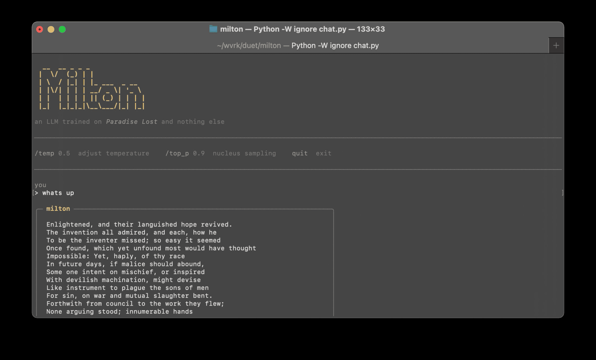

```
  __  __ _ _ _
 |  \/  (_) | |
 | \  / |_| | |_ ___  _ __
 | |\/| | | | __/ _ \| '_ \
 | |  | | | | || (_) | | | |
 |_|  |_|_|_|\__\___/|_| |_|
```

A language model trained on Paradise Lost and nothing else.



35M parameter transformer, custom BPE tokenizer, trained from scratch on a single text. No pre-training, no fine-tuning, no instruction data. Milton's entire knowledge of language comes from one poem.

## Quickstart

```
python3 -m venv .venv && source .venv/bin/activate
pip install -r requirements.txt
python3 get_data.py
python3 tokenizer.py
python3 train.py
python3 chat.py
```

Training takes ~55 minutes on an M3 Max (MPS).

## Model

| | |
|---|---|
| Parameters | 35.6M |
| Architecture | Decoder-only transformer |
| Layers | 8 |
| Embedding dim | 512 |
| Attention heads | 8 |
| FFN | SwiGLU, 2048 hidden |
| Positional encoding | RoPE |
| Context window | 512 tokens |
| Vocabulary | 4,096 BPE tokens trained on the text |
| Training data | Paradise Lost, Books I–XII (124,831 tokens) |
| Dropout | 0.2 + 5% word-level dropout |
| Final loss | 0.128 |

## How it works

At inference, a TF-IDF retriever indexes Paradise Lost into ~350 passages and finds the most relevant one for your input. The retrieved passage seeds Milton's generation so he responds about what you actually asked rather than from a random point in the poem.

Training mixes raw text sequences (70%) with topically aligned chat pairs (30%). Chat pairs use TF-IDF-extracted keywords as prompts mapped to their source passages, teaching the model to associate topic words with relevant text. Word-level dropout (5% random token replacement) and increased regularization prevent verbatim memorization and encourage recombination.

## Files

| File | |
|---|---|
| `get_data.py` | Download and clean Paradise Lost from Project Gutenberg |
| `tokenizer.py` | Train a BPE tokenizer on the text |
| `model.py` | Transformer architecture |
| `train.py` | Training loop with word dropout and chat-formatted sequences |
| `chat.py` | Terminal chat interface with retrieval-seeded generation |
| `retriever.py` | TF-IDF passage retriever over Paradise Lost |
